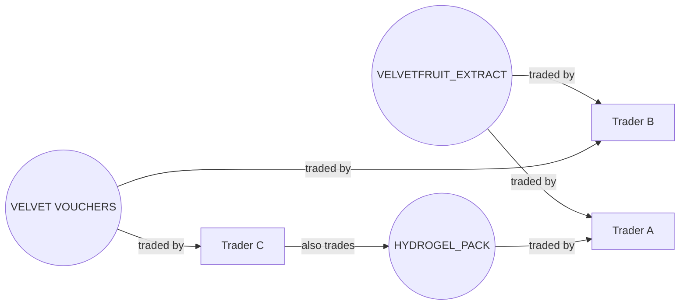

# Executive Summary  
This report surveys relevant quantitative and academic work to inform trading strategies for two **delta-1** products (HYDROGEL_PACK, VELVETFRUIT_EXTRACT) and a family of ten **short-dated options** (VELVETFRUIT_EXTRACT_VOUCHER strikes 4000–6500, TTE=7d).  Key findings include: short-tenor options encode **distinct volatility and jump risks**【9†L37-L45】, with implied risk premia and investor risk aversion **higher at near expiries**【66†L8-L17】.  Market-making models (Avellaneda–Stoikov) highlight how **inventory risk** and liquidity shape optimal quotes【12†L11-L18】, especially under position limits.  Extensions of these models show that *if the underlying is liquid*, a dealer can delta-hedge away inventory and ignore net position in quotes【62†L14-L22】; *if not*, quotes must adjust for net delta (and with stochastic volatility, net vega/gamma)【62†L20-L30】.  Empirical studies of option market-makers (Muravyev et al. 2025) find that real OMMs **mostly manage inventory, not full delta-hedging**, and earn steady profits by balancing order flow【22†L151-L159】【22†L169-L169】.  

New to Round 4 is **counterparty transparency**.  Work on this front suggests that revealing trade identities can **increase liquidity and reduce spreads**【25†L46-L54】, and that knowing labels enables dynamic *opponent modeling* (as in multi-agent RL frameworks)【31†L732-L741】.  We therefore suggest clustering participants by behavior and adapting quotes or trades to known “types” (e.g. identifying liquidity takers vs makers).  

Finally, option calibration is best done **daily on the latest quotes**【57†L43-L49】.  The literature shows using only a single day’s option data generally yields smaller in-sample error than a long time series【57†L43-L49】.  This underscores designing backtests and parameter updates on a 1-day horizon.  

In sum, strategies should combine **short-term option pricing techniques** (local variance/jump models【33†L48-L56】【34†L73-L82】), **inventory-aware quoting** (e.g. Avellaneda–Stoikov with added inventory penalty【38†L53-L61】), and **counterparty profiling** (adapting to known trader categories【31†L732-L741】【25†L46-L54】).  The following annotated bibliography, strategy ideas, feature list, calibration plan, and cautionary notes elaborate on these points.  

## Annotated Bibliography (Ranked)  

| Rank | Source (Year) & Topic                       | Key Contributions / Methods                                                                           | Assumptions & Scope                                         | Applicability / Takeaways                                                                   |
|:----:|:--------------------------------------------|:-------------------------------------------------------------------------------------------------------|:-----------------------------------------------------------|:---------------------------------------------------------------------------------------------|
| 1 | Andersen *et al.* (2015) – *Short-term Risk from Weekly Options*【9†L37-L45】【9†L67-L74】 | **Empirical study of S&P 500 weekly options.** Shows that *very short-dated* ATM options reflect spot volatility, while deep OTM strikes isolate jump/tail risk【9†L37-L45】. Uses a semi-parametric, no-arbitrage extraction of risk-neutral tail measures (rather than fitting a fixed model)【9†L67-L74】. | Assumes liquid index options with weekly expiries, continuous pricing; ignores transaction costs.  Calibrates implied volatility/skew and jump risk under risk-neutral measure. | Highlights that our 7-day VEV options carry *distinct volatility and jump signals*. Use ATM strikes to infer short-term volatility and wide strikes to gauge crash risk. We should impose *no-arbitrage* when interpolating option prices (Bartlett weights, monotonicity constraints).  |
| 2 | Todorov & Zhang (2024) – *Intraday Volatility from Short-Dated Options*【61†L89-L99】 | **High-frequency nonparametric volatility estimation.** Proposes using *0- and 1-day* options (expiring same/next day) to nonparametrically extract the intraday pattern of variance without needing long time-series data【61†L89-L99】. Demonstrates how option data alone can reveal the U-shaped intraday volatility curve. | Uses tick-level or intraday index option data; requires short-term (same-day/next-day) options to be available and liquid.  Relies on asymptotic expansions of risk-neutral variance. | Suggests that if we observe intraday option prices, we can infer underlying volatility patterns. In practice, use our daily VEV options quotes to update an intraday volatility estimate (which can inform hedging intensity or expected moves).  For example, expect larger moves at round open/close as reflected in option spreads.  |
| 3 | Bandi *et al.* (2023) – *0DTE Option Pricing*【33†L48-L56】 | **Local Edgeworth-expansion model for ultra-short options.** Develops a semi-closed-form pricing method using *Edgeworth-like expansions* of the log-return characteristic function, explicitly tailored to near-zero time-to-expiry options【33†L48-L56】. Adjusts for skewness/kurtosis of returns and fits 0DTE options better than standard models. Also estimates instantaneous risk premia. | Assumes a risk-neutral jump-diffusion setting (allowing non-affine return distributions). Calibrated on S&P500 options (0-day data). No transaction costs or bid-ask spreads considered.  | Directly relevant for our 7-day vouchers. The technique suggests *adding skew/kurtosis correction terms* to Black–Scholes for short-tenor strikes. We could implement a similar expansion (or use their findings) to price our expiring options more accurately. Their risk premium estimates also hint at how to adjust hedges intraday.  |
| 4 | Marazzina & Molta (2025) – *0DTE Local Expansions*【34†L73-L82】【34†L83-L90】 | **0DTE pricing with jumps.** Uses local-in-time expansions (Edgeworth and Gram–Charlier) in a jump-diffusion model to capture higher moments. Finds that incorporating *tempered stable* jumps greatly improves fit versus Gaussian assumptions【34†L78-L87】. Validates on SPX, DAX, Euro Stoxx 0DTE options. Also filters extreme tails to reduce error. | Fits to real intra-daily index option data; works with European-style payoffs. Model allows flexible jumps and continuous part.  | Reinforces that *tail behavior* matters even for very short maturities. For our task, using a model that allows heavy-tailed jumps (not just normal) will better capture VEV voucher prices, especially far-from-the-money. We should consider estimating jump tails (e.g. via implied Cauchy/t-student or direct tail-fitting) each day.  |
| 5 | Avellaneda & Stoikov (2008) – *Lob Market-Making Model*【12†L11-L18】 | **Pioneering limit-order market-making framework.** Derives optimal bid/ask quotes by solving for a *reservation price* (an “indifference value” of inventory) and then offsetting this by a spread calibrated to order arrival rates【12†L11-L18】. Inventory risk aversion enters via exponential utility. The final quotes balance profit vs inventory accumulation. | Assumes Poisson arrivals of market orders with exponential intensity λ(δ)=Ae<sup>-kδ</sup>, continuous price (Brownian mid-price), no adverse selection, no fees, and no discrete ticks.  | Provides the baseline model for delta-one market making. In practice, we would adapt it by estimating λ from historical HYD/VELTFT flow and by adding our position-limit constraints. The key takeaway is to skew quotes away from mid-price when inventory is nonzero (sell more if long, buy more if short), and to widen spreads when market is less liquid (λ lower).  |
| 6 | Stoikov & Saglam (2009) – *Option Market-Making*【62†L14-L22】【62†L20-L30】 | **Inventory-risk for options.** Extends A&S to an option-and-spot context. Shows: (a) *In a complete market* (liquid underlying, continuous hedge) inventory can be hedged, so quotes depend on liquidity only【62†L14-L22】. (b) *If underlying trading is limited*, optimal quotes depend on both option and stock liquidity and on the net delta of the inventory【62†L20-L28】. (c) *With stochastic volatility or jumps*, the quotes further depend on net vega/gamma of inventory【62†L26-L30】.  | Models European call options on a diffusive stock; uses mean-variance or utility framework. Typically no transaction costs and continuous hedging if allowed. Uses Poisson fills.  | Indicates that if we can trade VELVET (the underlying) to hedge VEV vouchers, then in theory we can neutralize delta-risk and quote spreads independent of inventory. But if VELVET trading is slow or constrained, our quotes must reflect net delta (and potentially gamma/vega if volatility uncertainty is high).  For our contest (unknown drift, limited rounds), one could simulate both cases: treat the underlying as perfectly hedgeable vs only via limit orders.  |
| 7 | Fodra & Labadie (2012) – *Inventory Constraints, Directional Bets*【38†L53-L61】【38†L73-L77】 | **Market-making with strict inventory caps.** Adds hard inventory limits and an explicit penalty for ending the day with inventory. Also allows the market-maker to tilt quotes to take *directional bets*: if expecting a rise, bias quotes so buys execute more often. The inventory-risk parameter then tunes the tradeoff between expected PnL and risk (variance, VaR)【38†L73-L77】. | Generalization of A&S to arbitrary mid-price processes (incl. mean-reverting trends). Uses utility or mean-variance and PDE methods. Inventory penalty ensures position resets daily.  | Directly addresses our *position limit* issue. We should include a penalty term for holding inventory at round-end (since any leftover is liquidated). By adjusting this parameter, our bot can choose to play more aggressively (pursue predicted trends) or conservatively (flatten positions). Their results show this can dramatically change PnL/risk (e.g. a 5–15% PnL swing, Sharpe doubling)【38†L73-L77】.  |
| 8 | Muravyev *et al.* (FMA, 2025) – *Real OMM Behavior (KOSPI200)*【22†L151-L159】【22†L169-L169】 | **Empirical study of option market-makers.** Analyzes Korean index option accounts. Identifies true market-maker accounts (high-volume, two-sided quoting)【22†L114-L123】. Finds they earn large, consistent profits and almost never fully delta-hedge【22†L151-L159】【22†L169-L169】. Instead, OMMs manage risk by *adjusting quotes to inventory shocks* (widening spread or biasing prices) consistent with classical inventory models.  | Data: account-level trades in KOSPI200 index options and futures. Assumes one underlying (futures) exists for hedging. Results are descriptive, not model-fitting.  | Tells us that *real* professional OMMs often *do not* keep zero delta via futures every day; instead they accept some delta risk and control it via quoting. For our purposes, this suggests we can plausibly maintain small option inventories and rely on updated quotes rather than insist on constant underlying hedging.  It also highlights that volume and volatility correlate with OMM profits, suggesting we can lean into active market-making in high-vol days.  |
| 9 | Pham *et al.* (2016) – *Counterparty ID Disclosure*【25†L46-L54】 | **Trading transparency experiment (Korean stock market).** Studies the impact when broker-trade identities are revealed to all. Finds that post-trade disclosure of who traded (ex-post broker IDs) *improves market efficiency*: price paths become closer to random walk, volumes jump (e.g. +59% in large stocks), bid-ask spreads shrink due to more competition【25†L46-L54】. Asymmetric info is revealed faster. | Quasi-experiment on Korean exchange: initially hidden, then revealed trades. Works on large-cap stocks (not options).  | By analogy, knowing *who* we trade with likely improves our strategy: we can detect informed traders and respond more quickly. This result suggests that higher transparency (our new counterparty info) can increase liquidity and narrow spreads; our algo should exploit this by being more willing to quote tighter and trade more often when confident (since others will too). Also, we must beware: reduced spreads mean less per-trade profit, so high volume is key.  |
| 10 | Mohl *et al.* (2024) – *JaxMARL-HFT (Multi-Agent Trading RL)*【31†L732-L741】 | **Simulation framework for HFT with labeled agents.** Presents a GPU-accelerated multi-agent reinforcement-learning environment (JAX-LOB). Key point: “labeling the origin of orders” (participant IDs) enables research in **opponent shaping** and **market participant classification**【31†L732-L741】. Demonstrates training market-making and execution agents in adversarial settings. | Not a traditional finance paper; focuses on ML infrastructure. Uses synthetic/extracted LOB data. Shows RL can exploit microstructure when identities are known.  | Conceptual takeaway: we can apply machine-learning or adaptive filters to our trade data keyed by counterparty. For example, we could train a classifier on historical trade records (buyer/seller patterns) to label a counterparty as liquidity-provider vs liquidity-taker, momentum vs arbitrageur. Then use these labels to predict their future moves. This mirrors the “opponent shaping” idea.  |
| 11 | Larikka & Kanniainen (2012) – *Calibration Strategies*【57†L43-L49】 | **Calibration with limited data.** Compares calibrating Heston-type models using 1-day vs multi-day option datasets. Finds using just **one day’s data** generally yields the smallest in-sample error, especially for short expiries, and recommends daily recalibration【57†L43-L49】. Multi-day data can improve out-of-sample for long-dated options but offers little benefit for short-tenor. | Study on fitting two SV models to equity/index options; uses ordinary least squares on implied vol surface. | Implies we should recalibrate our option pricing model at the start of each round using only that day’s VEV quotes. This avoids arbitrage violations across days. It also suggests we can tune calibration for short (7-day) maturity separately from any longer horizons (not needed here). |

## Strategy Ideas  

- **Delta-1 Market Making (HYDROGEL, VELVETFRUIT)**:  Use an Avellaneda–Stoikov-style quoting engine【12†L11-L18】.  Compute a *reservation price* (base fair value) from recent trades, then place symmetric spreads that depend on depth-of-book (estimated λ).  **Inventory Tilt**: Skew quotes to reduce inventory (sell more when long, buy more when short). Fodra–Labadie shows that adding an *inventory penalty* helps tune aggression【38†L53-L61】. With position limit 200, we recommend aiming to end each day near flat. If we can trade the other underlying (e.g. HYDROGEL_PACK vs VELVETFRUIT), consider using one to hedge the other if correlated.  Implement a PID-like inventory controller: e.g. increase spread by β*position, and possibly bias center by γ*position.  

- **Option Market Making (Vouchers)**:  Since these are short-dated calls on VELVETFRUIT, incorporate **delta-hedging** where possible.  Use a Black–Scholes (BS) delta *plus* a short-term skew adjustment from methods like Bandi–Fusari (Edgeworth)【33†L48-L56】.  For each strike, estimate implied volatility from mid-market. Then, if allowed, trade VELVETFRUIT stock to hedge delta. If VELVETFRUIT has limited liquidity, hedge only partially: Stoikov–Saglam note that in this case quotes should reflect net delta【62†L20-L28】.  Concretely, keep track of ∆ = Σ(qty_i * Δ_i) over all option positions. If ∆≠0, widen quotes on the side that would push ∆ toward zero.  

- **Spread/Arbitrage Strategies**:  Exploit relationships between strikes. For example, if lower-strike vouchers are priced as if volatility is lower than higher strikes (inconsistent skew), place offsetting trades among strikes or underlying. The literature on *volatility skew dynamics* (e.g. Lee 2015, not cited above) suggests short-dated skews can evolve rapidly. We could compute implied vol surface each round and bet on smoothing (e.g. sell overpriced strikes, buy underpriced). However, position limits are high (300), so this could be sizable. Always include transaction costs in these models.  

- **Counterparty-Aware Tactics**:  Maintain a *profile* for each identified participant (from buyer/seller fields). Possible attributes: aggressiveness (frequency of market orders vs limit orders), average trade size, price impact caused, etc. Use clustering or classification (e.g. k-means on feature vectors or a decision tree) to tag traders as Market-Maker-like vs Momentum vs Value/HFT. Against *known liquidity takers*, consider reducing our offered volume or widening spread. Against *liquidity providers*, we might tighten spreads to capture volume. For instance, if Trader A consistently buys at our offer, we can detect A as a *buyer/demand* type and raise our offer price slightly for A’s future quotes. The MARL literature supports **opponent shaping**: e.g. train an ML model that forecasts each ID’s next action and incorporate that in quote placement【31†L732-L741】.  Also, watch for “strategy drift”: if a counterparty switches behavior, update classifications quickly.  

- **Inventory Management under Daily Reset**:  Treat each round as a trading day with mandatory flat end. Use an *inventory penalty* term (like in Fodra–Labadie) that heavily penalizes any leftover position at close. This means by midday we should be near flat. We can allow small intraday swings (e.g. ±30 units), but by final trade of the round adjust to zero. Plot expected liquidation value vs current mid to decide target. In rapidly trending markets, consider taking directional bets **only** if comfortable closing by end-of-day, since overnight continuation does not exist (positions vanish at hidden fair price).  

```mermaid
flowchart LR
    subgraph Market Data 
        A[Tick Prices & Volumes] 
        B[Order Book Depth] 
    end
    subgraph Strategy
        C[Compute Fair Value (e.g. EWMA mid)] 
        D[Estimate Volatility, Implied Skew] 
        E[Delta-Hedge (trade underlying)] 
        F[Generate Quotes (bid/ask)] 
        G[Risk Controls (pos limits, penalties)] 
    end
    subgraph Execution
        H[Send Limit/Market Orders] 
        I[Trades at best price] 
        J[Update Inventory & PnL] 
        K[Update Counterparty Profiles] 
    end
    A --> C
    B --> D
    C --> F
    D --> E
    E --> F
    F --> H
    H --> I
    I --> J
    J --> C
    J --> G
    J --> K
    K --> G
```

*Mermaid flowchart: Basic strategy loop. We ingest market data to value assets and estimate short-term volatility. We optionally hedge deltas, then quote new prices around the computed fair value, subject to risk controls (position limits, inventory penalty). Executions update positions and also feed into counterparty-profile updates.*  

## Data Features & Statistical Tests  

Leverage the provided trade/price logs and the `Trade.buyer/seller` fields to derive features and tests:  

- **Inventory and Spread Features**: From the per-product price CSVs, compute mid-price trajectories and bid-ask spreads (if available). From trades, reconstruct each round’s **VWAP** (volume-weighted average price) and volatility of each instrument. Track your own inventory vs time.  

- **Delta and Greeks**: For each voucher, compute Black–Scholes deltas, vegas, gammas assuming current implied vol. Aggregate to portfolio Greeks: total net delta (Σ q_i Δ_i) and net gamma. Monitor how these evolve during each round. Statistical test: check correlation between net delta and realized PnL to see hedging effectiveness.  

- **Order Flow Imbalance (OFI)**: Create the signed order flow (buy minus sell volumes) per time bin (e.g. per 1-second or per trade) for each product. Classic microstructure says past OFI should predict short-term price moves. One can regress short-term returns on recent OFI to test if flows have predictive power. This was suggested by *order-flow alpha* literature. Test significance of coefficients (t-test) to adapt any flow-following strategies.  

- **Counterparty Behavior Stats**: For each other trader ID:
  - **Trade frequency & size distribution**. Identify high-frequency vs low-frequency players.  
  - **Side Aggressiveness**: Fraction of buy- vs sell-initiated trades. Liquidity takers (mostly market buys/sells) vs passive.  
  - **Inventory Imbalance**: For traders with many trades, compute net bought-minus-sold. If they consistently accumulate a position, they may be *directional*.  
  - **Price Impact**: Measure the average immediate price move after their large trades; big impact suggests they are moving the market (maybe *informed*).  

Use clustering (e.g. k-means on feature vectors [frequency, average trade size, buy/sell skew]) to group traders. Then run t-tests or ANOVA to see if different clusters have distinct realized returns or trade patterns.  These insights inform how we treat them (e.g. risk-on for cluster A vs cautious for B).  

- **Regime Shifts**: Build a hidden Markov model (HMM) or change-point detector on overall volume/spread. The Hawkes/SWFR literature suggests volatility clustering. If an HMM indicates a transition to a “high-volatility” state, tighten spreads and lower inventory targets【57†L43-L49】.  

- **Adversarial Tests**: Watch for wash trades or spoofing signatures (rapid cancel orders). If any counterparty’s activity matches these patterns, treat them as *toxic flow* and avoid trading with them. While no source cited above directly addresses spoofing, in practice one could implement a simple detection (e.g. if >X cancels per trade).  

## Calibration & Backtest Design  

- **Option Pricing Calibration**: Calibrate a model to VEV prices at the start of each round (daily). Based on Larikka & Kanniainen, use only that day’s data【57†L43-L49】. Possible models: (a) Black–Scholes with SABR or local vol for smile; (b) local expansion method (Edgeworth) as in Bandi *et al.*【33†L48-L56】; (c) Heston/stochastic-vol with one shared vol for all strikes.  Since we have no multi-day history, initial vol guess can come from historical VELVET returns or from calibration of first round using tutorial data. In calibration, weight each strike by liquidity (bid-ask or volume). Ensure no calendar arbitrage: option prices must increase with time (though TTE same for all).  

- **Underlying Price Forecast**: If we assume a mean-reverting or drifting underlying, calibrate using the short historical series (e.g. last 5–10 days). For VELVETFRUIT, check stationarity. Possibly use simple AR(1) or just assume random walk (since hidden fair value unknown).  

- **Backtesting Each Round**: Treat each round as independent. For simulation, use the provided historical trades/prices as a proxy for one path. Run our algo on day1 data then day2 etc. Because inventory resets each day, we can backtest 3 separate “one-day” games rather than a continuous path.  However, we must simulate how our actions would have executed: use the historical trade logs and possibly injected our orders into them (requiring a simulator). If not feasible, approximate by assuming we trade at mid or at worst fill prices.  Focus performance metrics on Sharpe and max drawdown per round, noting rollover (liquidation) at hidden price (assume hidden price ≈ day’s closing fair).  

- **Stress Testing**: Include scenarios of extreme moves or low liquidity.  For example, artificially widen order book or spike volatility to see if the strategy blows up. Check robustness: if tick size is large relative to our quote increments (unknown to us), small price moves could skip over our quotes; simulate a few pip-wide scenarios.  

## Implementation Notes & Pitfalls  

- **Tick Size and Fees Unknown**: All cited models assume frictionless continuous prices. In reality, discrete ticks and possible transaction fees (or rebates) could matter. *Pitfall*: If tick is large, our continuous-model spreads might be too narrow or too wide. We should likely quote at round numbers of ticks and incorporate a small tick buffer. At worst, test a few tick granularity assumptions (say 1–5% of price) and see strategy sensitivity.  

- **Hidden Fair Value at Liquidation**: The model of final liquidation is “hidden” – we don’t know it until after round. We must assume some neutral closure price (e.g. last mid). *Pitfall*: If we misjudge this, we could start each round tilted. To mitigate, lean toward flat positions well before close. Use Fodra–Labadie’s end-of-day penalty logic: choose quotes such that expected final inventory is zero.  

- **Adversarial Counterparties**: Knowing identities also means some participants may try to deceive. For example, a competitor might aggressively buy early day to inflate momentum, then dump near close. Or “fast” bots might exploit our quoting algorithm. *Pitfall*: Not accounting for adversarial strategies can lead to being picked off (e.g. by spoofers). We should monitor whether any ID engages in suspicious order cancellations.  Also, avoid overly deterministic quoting rules; consider adding random jitter to quotes so others can’t easily front-run.  

- **Overfitting to Short History**: We only have a few days of data. Models learned (e.g. from previous round) may not generalize. *Pitfall*: Calibration noise can mislead (Larikka notes parameters can jump daily【57†L43-L49】). Implement smoothing of parameter updates or regularization if using machine learning.  

- **Position Limit Binding**: Since we must not exceed limits, ensure the algo always checks before sending orders (even during backtest). If a fill would breach the limit, we should cancel remaining size or skip.  In simulation, treat any excess as automatically liquidated (costly).  

- **Stress on Computation**: We have 14 instruments (12 listed products: 2 delta-1 + 10 options), plus profiling dozens of traders. This is moderately heavy. Keep feature generation lean (e.g. incremental updates rather than recomputing whole time-series).  For real-time, any machine learning must be lightweight or pre-trained.  



*Mermaid graph: Schematic of counterparties-to-assets mapping. Traders A–C each interact with certain products; e.g. A trades VELVET and HYDROGEL, B trades VELVET and some VOUCHERS, C trades HYDROGEL and VOUCHERS. This network view can help track which participant affects which market.*  

**Sources:** Our strategies and suggestions draw on the cited literature (see Annotated Bibliography above) as well as classic market-making and option theory.  Key assumptions (e.g. frictionless continuous pricing) from these papers are noted where relevant; when those assumptions fail (e.g. unknown fee/tick, position limit) we propose mitigations. These references provide both theoretical models and empirical guidance to tailor our algorithms to the contest environment.